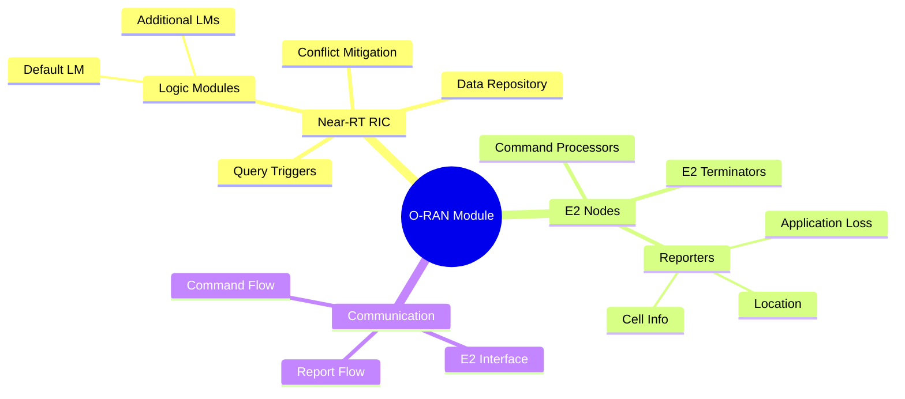
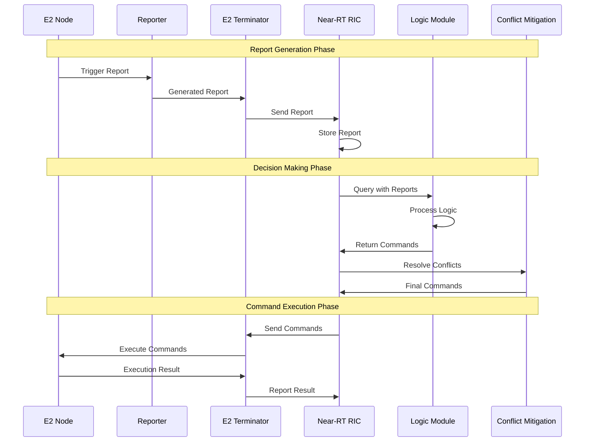

# O-RAN User Guide

## Table of Contents

- [Getting Started](#getting-started)
- [Basic Concepts](#basic-concepts)
- [Configuration Guide](#configuration-guide)
- [Development Workflow](#development-workflow)
- [Common Use Cases](#common-use-cases)
- [Troubleshooting](#troubleshooting)
- [Best Practices](#best-practices)
- [Advanced Topics](#advanced-topics)

## Getting Started

### Prerequisites Check

Before starting with the O-RAN module, ensure your system meets the requirements:

```bash
# Check ns-3 installation
./waf --check

# Verify SQLite installation
sqlite3 --version

# Check compiler support
g++ --version  # Should support C++14 or later
```

### First Simulation

Let's create your first O-RAN simulation to understand the basic workflow:

```cpp
#include "ns3/core-module.h"
#include "ns3/oran-module.h"

using namespace ns3;

int main() {
    // Enable logging for debugging
    LogComponentEnable("OranHelper", LOG_LEVEL_INFO);
    LogComponentEnable("OranNearRtRic", LOG_LEVEL_INFO);
    
    // Create simulation nodes
    NodeContainer nodes;
    nodes.Create(3);  // Create 3 nodes
    
    // Configure O-RAN helper
    Ptr<OranHelper> oranHelper = CreateObject<OranHelper>();
    oranHelper->SetAttribute("Verbose", BooleanValue(true));
    
    // Set up data repository
    oranHelper->SetDataRepository("ns3::OranDataRepositorySqlite",
                                  "DatabaseFile", StringValue("first_sim.db"));
    
    // Configure logic module
    oranHelper->SetDefaultLogicModule("ns3::OranLmNoop");
    oranHelper->SetConflictMitigationModule("ns3::OranCmmNoop");
    
    // Create and configure RIC
    Ptr<OranNearRtRic> ric = oranHelper->CreateNearRtRic();
    
    // Configure E2 node terminators
    oranHelper->SetE2NodeTerminator("ns3::OranE2NodeTerminatorWired");
    oranHelper->AddReporter("ns3::OranReporterLocation",
                           "Trigger", StringValue("ns3::OranReportTriggerPeriodic"));
    
    // Deploy terminators on nodes
    OranE2NodeTerminatorContainer terminators = 
        oranHelper->DeployTerminators(ric, nodes);
    
    // Activate components
    Simulator::Schedule(Seconds(1.0), 
                       &OranHelper::ActivateAndStartNearRtRic, 
                       oranHelper, ric);
    Simulator::Schedule(Seconds(2.0), 
                       &OranHelper::ActivateE2NodeTerminators, 
                       oranHelper, terminators);
    
    // Run simulation
    Simulator::Stop(Seconds(30.0));
    Simulator::Run();
    Simulator::Destroy();
    
    return 0;
}
```

## Basic Concepts

### O-RAN Architecture Overview

The O-RAN module implements key components of the O-RAN architecture:



### Key Components

#### Near-RT RIC (RAN Intelligent Controller)

The RIC is the central intelligence component that:

- Collects reports from E2 nodes
- Executes logic modules to make decisions
- Sends commands back to nodes
- Manages data storage and retrieval

#### E2 Nodes

E2 Nodes are simulation nodes enhanced with O-RAN capabilities:

- Report node status and metrics
- Execute commands from the RIC
- Maintain registration with the RIC

#### Logic Modules (xApps)

Logic Modules implement the intelligence algorithms:

- Process collected reports
- Generate commands for network optimization
- Can use traditional algorithms or ML models

### Data Flow

Understanding the data flow is crucial for effective usage:



## Configuration Guide

### Helper Configuration

The `OranHelper` is the main configuration interface:

```cpp
Ptr<OranHelper> oranHelper = CreateObject<OranHelper>();

// Basic configuration
oranHelper->SetAttribute("Verbose", BooleanValue(true));
oranHelper->SetAttribute("LmQueryInterval", TimeValue(Seconds(5.0)));
oranHelper->SetAttribute("LmQueryMaxWaitTime", TimeValue(Seconds(1.0)));

// E2 node management
oranHelper->SetAttribute("E2NodeInactivityThreshold", TimeValue(Seconds(10.0)));
oranHelper->SetAttribute("E2NodeInactivityIntervalRv", 
                        StringValue("ns3::ConstantRandomVariable[Constant=5.0]"));
```

### Data Repository Configuration

#### SQLite Backend

```cpp
// Basic SQLite configuration
oranHelper->SetDataRepository("ns3::OranDataRepositorySqlite",
                              "DatabaseFile", StringValue("simulation.db"));

// Advanced SQLite configuration
oranHelper->SetDataRepository("ns3::OranDataRepositorySqlite",
                              "DatabaseFile", StringValue("simulation.db"),
                              "JournalMode", StringValue("WAL"),
                              "SynchronousMode", StringValue("NORMAL"),
                              "CacheSize", UintegerValue(64000));
```

#### Custom Data Repository

To implement a custom data repository:

```cpp
class MyDataRepository : public OranDataRepository {
public:
    static TypeId GetTypeId();
    
    // Implement required methods
    virtual uint64_t RegisterE2Node(Ptr<OranE2NodeTerminator> terminator) override;
    virtual void StoreReport(Ptr<OranReport> report) override;
    // ... other methods
};

// Register the new type
TypeId MyDataRepository::GetTypeId() {
    static TypeId tid = TypeId("ns3::MyDataRepository")
        .SetParent<OranDataRepository>()
        .AddConstructor<MyDataRepository>();
    return tid;
}

// Use in configuration
oranHelper->SetDataRepository("ns3::MyDataRepository",
                              "CustomParameter", StringValue("value"));
```

### Logic Module Configuration

#### Built-in Logic Modules

```cpp
// No-operation logic module (default)
oranHelper->SetDefaultLogicModule("ns3::OranLmNoop");

// Distance-based handover logic
oranHelper->SetDefaultLogicModule("ns3::OranLmLte2LteDistanceHandover",
                                  "HandoverThreshold", DoubleValue(100.0),
                                  "ProcessingDelayRv", 
                                  StringValue("ns3::ConstantRandomVariable[Constant=0.01]"));

// RSRP-based handover logic
oranHelper->SetDefaultLogicModule("ns3::OranLmLte2LteRsrpHandover",
                                  "RsrpThreshold", DoubleValue(-90.0),
                                  "RsrqThreshold", DoubleValue(-10.0));
```

#### Machine Learning Logic Modules

```cpp
// PyTorch-based logic module
oranHelper->SetDefaultLogicModule("ns3::OranLmLte2LteTorchHandover",
                                  "ModelPath", StringValue("model.pt"),
                                  "InputSize", UintegerValue(10),
                                  "OutputSize", UintegerValue(2));

// ONNX-based logic module
oranHelper->SetDefaultLogicModule("ns3::OranLmLte2LteOnnxHandover",
                                  "ModelPath", StringValue("model.onnx"),
                                  "ProviderType", StringValue("CPU"));
```

#### Adding Additional Logic Modules

```cpp
// Add multiple logic modules
oranHelper->AddLogicModule("HandoverLM", "ns3::OranLmLte2LteDistanceHandover");
oranHelper->AddLogicModule("LoadBalancingLM", "ns3::OranLmLoadBalancing");
oranHelper->AddLogicModule("InterferenceLM", "ns3::OranLmInterferenceMitigation");
```

### E2 Node Configuration

#### Node Terminator Types

```cpp
// Wired node terminator
oranHelper->SetE2NodeTerminator("ns3::OranE2NodeTerminatorWired",
                                "RegistrationIntervalRv",
                                StringValue("ns3::ConstantRandomVariable[Constant=1.0]"),
                                "SendIntervalRv",
                                StringValue("ns3::ConstantRandomVariable[Constant=1.0]"));

// LTE UE terminator
oranHelper->SetE2NodeTerminator("ns3::OranE2NodeTerminatorLteUe",
                                "RegistrationIntervalRv",
                                StringValue("ns3::ExponentialRandomVariable[Mean=2.0]"),
                                "TransmissionDelayRv",
                                StringValue("ns3::ConstantRandomVariable[Constant=0.001]"));

// LTE eNB terminator
oranHelper->SetE2NodeTerminator("ns3::OranE2NodeTerminatorLteEnb",
                                "RegistrationIntervalRv",
                                StringValue("ns3::ConstantRandomVariable[Constant=1.0]"),
                                "SendIntervalRv",
                                StringValue("ns3::ConstantRandomVariable[Constant=0.5]"));
```

#### Reporter Configuration

```cpp
// Location reporter with periodic trigger
oranHelper->AddReporter("ns3::OranReporterLocation",
                        "Trigger", StringValue("ns3::OranReportTriggerPeriodic"),
                        "ReportingInterval", TimeValue(Seconds(2.0)));

// LTE UE cell info reporter with handover trigger
oranHelper->AddReporter("ns3::OranReporterLteUeCellInfo",
                        "Trigger", 
                        StringValue("ns3::OranReportTriggerLteUeHandover[InitialReport=true]"));

// Application loss reporter with threshold trigger
oranHelper->AddReporter("ns3::OranReporterAppLoss",
                        "Trigger", StringValue("ns3::OranReportTriggerThreshold"),
                        "LossThreshold", DoubleValue(0.1));
```

### Query Trigger Configuration

```cpp
// Add custom query trigger
oranHelper->AddQueryTrigger("CustomTrigger",
                           "ns3::OranQueryTriggerCustom",
                           "CustomCallback",
                           CallbackValue(MakeCallback(&MyTriggerFunction)));

// Periodic query trigger
oranHelper->AddQueryTrigger("PeriodicTrigger",
                           "ns3::OranQueryTriggerPeriodic",
                           "QueryInterval", TimeValue(Seconds(10.0)));

// Report-based query trigger
oranHelper->AddQueryTrigger("ReportTrigger",
                           "ns3::OranQueryTriggerReport",
                           "ReportType", StringValue("LocationReport"),
                           "MinReports", UintegerValue(5));
```

## Development Workflow

### Creating Custom Components

#### Custom Logic Module

```cpp
class MyLogicModule : public OranLm {
public:
    static TypeId GetTypeId();
    
    virtual std::vector<Ptr<OranCommand>> Logic(
        std::vector<Ptr<OranReport>> reports) override;

private:
    double m_threshold;
    std::string m_algorithm;
};

// Implementation
std::vector<Ptr<OranCommand>> MyLogicModule::Logic(
    std::vector<Ptr<OranReport>> reports) {
    
    std::vector<Ptr<OranCommand>> commands;
    
    // Process reports
    for (auto report : reports) {
        if (auto locationReport = DynamicCast<OranReportLocation>(report)) {
            Vector position = locationReport->GetPosition();
            
            // Apply custom logic
            if (ShouldTriggerAction(position)) {
                Ptr<OranCommand> command = CreateCommand(report->GetNodeId());
                commands.push_back(command);
            }
        }
    }
    
    // Log the decision
    GetDataRepository()->LogMessage("MyLogicModule executed with " + 
                                   std::to_string(reports.size()) + " reports");
    
    return commands;
}

bool MyLogicModule::ShouldTriggerAction(Vector position) {
    // Implement your logic here
    return (position.x > m_threshold);
}
```

#### Custom Reporter

```cpp
class MyReporter : public OranReporter {
public:
    static TypeId GetTypeId();

protected:
    virtual Ptr<OranReport> GenerateReport() override;

private:
    std::string m_metricName;
    double GetCustomMetric();
};

Ptr<OranReport> MyReporter::GenerateReport() {
    Ptr<MyCustomReport> report = CreateObject<MyCustomReport>();
    report->SetNodeId(GetE2Terminator()->GetNodeId());
    report->SetTimestamp(Simulator::Now());
    report->SetMetricValue(GetCustomMetric());
    
    return report;
}
```

### Testing Strategy

#### Unit Testing

```cpp
class MyLogicModuleTestCase : public TestCase {
public:
    MyLogicModuleTestCase() : TestCase("MyLogicModule basic functionality") {}

private:
    virtual void DoRun() override;
};

void MyLogicModuleTestCase::DoRun() {
    // Create test environment
    Ptr<MyLogicModule> lm = CreateObject<MyLogicModule>();
    
    // Create test reports
    std::vector<Ptr<OranReport>> reports;
    Ptr<OranReportLocation> report = CreateObject<OranReportLocation>();
    report->SetPosition(Vector(100.0, 50.0, 0.0));
    reports.push_back(report);
    
    // Test logic execution
    std::vector<Ptr<OranCommand>> commands = lm->Logic(reports);
    
    // Verify results
    NS_TEST_ASSERT_MSG_EQ(commands.size(), 1, "Should generate one command");
}

// Register test
static TestSuite g_myTestSuite("my-logic-module", TestSuite::UNIT);

class MyLogicModuleTestSuite : public TestSuite {
public:
    MyLogicModuleTestSuite() : TestSuite("my-logic-module", UNIT) {
        AddTestCase(new MyLogicModuleTestCase, TestCase::QUICK);
    }
};

static MyLogicModuleTestSuite g_myLogicModuleTestSuite;
```

#### Integration Testing

```cpp
void TestIntegration() {
    // Create complete test scenario
    NodeContainer nodes;
    nodes.Create(5);
    
    // Set up mobility
    MobilityHelper mobility;
    mobility.SetMobilityModel("ns3::ConstantVelocityMobilityModel");
    mobility.Install(nodes);
    
    // Configure O-RAN
    Ptr<OranHelper> oranHelper = CreateObject<OranHelper>();
    oranHelper->SetDefaultLogicModule("ns3::MyLogicModule");
    Ptr<OranNearRtRic> ric = oranHelper->CreateNearRtRic();
    
    // Deploy and run
    OranE2NodeTerminatorContainer terminators = 
        oranHelper->DeployTerminators(ric, nodes);
    
    // Add validation callbacks
    ric->Data()->TraceConnectWithoutContext("StoreCommand", 
                                           MakeCallback(&ValidateCommand));
    
    // Run simulation
    Simulator::Stop(Seconds(60));
    Simulator::Run();
    Simulator::Destroy();
}
```

## Common Use Cases

### LTE Handover Optimization

#### Distance-Based Handover

```cpp
void SetupDistanceHandover() {
    // Configure handover logic
    oranHelper->SetDefaultLogicModule("ns3::OranLmLte2LteDistanceHandover",
                                      "HandoverThreshold", DoubleValue(150.0),
                                      "HysteresisMargin", DoubleValue(10.0));
    
    // Set up UE reporters
    oranHelper->SetE2NodeTerminator("ns3::OranE2NodeTerminatorLteUe");
    oranHelper->AddReporter("ns3::OranReporterLocation",
                           "Trigger", StringValue("ns3::OranReportTriggerPeriodic"));
    oranHelper->AddReporter("ns3::OranReporterLteUeCellInfo",
                           "Trigger", 
                           StringValue("ns3::OranReportTriggerLteUeHandover"));
    
    // Set up eNB reporters
    oranHelper->SetE2NodeTerminator("ns3::OranE2NodeTerminatorLteEnb");
    oranHelper->AddReporter("ns3::OranReporterLocation",
                           "Trigger", StringValue("ns3::OranReportTriggerPeriodic"));
}
```

#### ML-Based Handover

```cpp
void SetupMLHandover() {
    // Train model (external script)
    std::system("python3 train_handover_model.py --output model.pt");
    
    // Configure PyTorch logic module
    oranHelper->SetDefaultLogicModule("ns3::OranLmLte2LteTorchHandover",
                                      "ModelPath", StringValue("model.pt"),
                                      "FeatureSize", UintegerValue(8),
                                      "PredictionThreshold", DoubleValue(0.7));
    
    // Enhanced reporting for ML features
    oranHelper->AddReporter("ns3::OranReporterLteUeRsrpRsrq",
                           "Trigger", StringValue("ns3::OranReportTriggerPeriodic"));
    oranHelper->AddReporter("ns3::OranReporterAppLoss",
                           "Trigger", StringValue("ns3::OranReportTriggerPeriodic"));
}
```

### Load Balancing

```cpp
class LoadBalancingLogicModule : public OranLm {
public:
    virtual std::vector<Ptr<OranCommand>> Logic(
        std::vector<Ptr<OranReport>> reports) override {
        
        std::map<uint16_t, std::vector<uint64_t>> cellLoad;
        
        // Analyze cell load from reports
        for (auto report : reports) {
            if (auto cellReport = DynamicCast<OranReportLteUeCellInfo>(report)) {
                uint16_t cellId = cellReport->GetCellId();
                uint64_t nodeId = cellReport->GetNodeId();
                cellLoad[cellId].push_back(nodeId);
            }
        }
        
        // Generate load balancing commands
        std::vector<Ptr<OranCommand>> commands;
        for (auto& cell : cellLoad) {
            if (cell.second.size() > m_maxUsersPerCell) {
                // Move excess users to less loaded cells
                auto handoverCommand = CreateHandoverCommand(
                    cell.second.back(), FindLeastLoadedCell(cellLoad));
                commands.push_back(handoverCommand);
            }
        }
        
        return commands;
    }

private:
    uint32_t m_maxUsersPerCell = 10;
    
    uint16_t FindLeastLoadedCell(const std::map<uint16_t, std::vector<uint64_t>>& cellLoad) {
        uint16_t bestCell = 0;
        size_t minLoad = SIZE_MAX;
        
        for (const auto& cell : cellLoad) {
            if (cell.second.size() < minLoad) {
                minLoad = cell.second.size();
                bestCell = cell.first;
            }
        }
        
        return bestCell;
    }
};
```

### Network Slice Management

```cpp
void SetupSliceManagement() {
    // Configure slice-aware logic module
    oranHelper->SetDefaultLogicModule("ns3::OranLmSliceManagement",
                                      "SliceConfigFile", StringValue("slices.json"),
                                      "QosEnforcement", BooleanValue(true));
    
    // Add slice-specific reporters
    oranHelper->AddReporter("ns3::OranReporterSliceMetrics",
                           "Trigger", StringValue("ns3::OranReportTriggerPeriodic"),
                           "MetricsInterval", TimeValue(Seconds(1.0)));
    
    // Configure conflict mitigation for slice priorities
    oranHelper->SetConflictMitigationModule("ns3::OranCmmSlicePriority",
                                            "PriorityConfigFile", 
                                            StringValue("slice_priorities.json"));
}
```

## Troubleshooting

### Common Issues

#### Database Connection Issues

```bash
# Symptoms: SQLite errors, database locked
# Solutions:
rm simulation.db  # Remove existing database
chmod 666 .      # Ensure write permissions

# Check database integrity
sqlite3 simulation.db "PRAGMA integrity_check;"
```

#### Memory Leaks

```cpp
// Enable memory debugging
export NS_LOG="OranHelper=level_all|prefix_time:OranDataRepository=level_all|prefix_time"

// Use valgrind for detailed analysis
valgrind --tool=memcheck --leak-check=full ./waf --run "your-simulation"
```

#### Performance Issues

```cpp
// Enable performance monitoring
oranHelper->SetAttribute("EnablePerfMonitoring", BooleanValue(true));

// Reduce report frequency
oranHelper->AddReporter("ns3::OranReporterLocation",
                        "Trigger", StringValue("ns3::OranReportTriggerPeriodic"),
                        "ReportingInterval", TimeValue(Seconds(10.0)));  // Increased interval

// Optimize database
oranHelper->SetDataRepository("ns3::OranDataRepositorySqlite",
                              "DatabaseFile", StringValue("simulation.db"),
                              "PragmaJournalMode", StringValue("WAL"),
                              "PragmaSynchronous", StringValue("NORMAL"));
```

### Debugging Techniques

#### Logging Configuration

```cpp
// Enable comprehensive logging
LogComponentEnable("OranHelper", LOG_LEVEL_ALL);
LogComponentEnable("OranNearRtRic", LOG_LEVEL_ALL);
LogComponentEnable("OranDataRepositorySqlite", LOG_LEVEL_INFO);
LogComponentEnable("OranLm", LOG_LEVEL_DEBUG);

// Custom log levels
LogComponentEnable("MyLogicModule", LOG_LEVEL_FUNCTION);
```

#### Trace Analysis

```cpp
// Enable tracing
oranHelper->SetAttribute("EnableTracing", BooleanValue(true));
oranHelper->SetAttribute("TraceFile", StringValue("oran_trace.txt"));

// Connect to specific traces
ric->Data()->TraceConnectWithoutContext("StoreReport", 
                                       MakeCallback(&TraceReportStorage));
ric->Data()->TraceConnectWithoutContext("StoreCommand", 
                                       MakeCallback(&TraceCommandStorage));

void TraceReportStorage(Ptr<OranReport> report) {
    std::cout << "Report stored: Node=" << report->GetNodeId() 
              << " Time=" << report->GetTimestamp() << std::endl;
}
```

#### Database Inspection

```sql
-- Connect to simulation database
sqlite3 simulation.db

-- Inspect schema
.schema

-- Check data
SELECT COUNT(*) FROM reports;
SELECT COUNT(*) FROM commands;
SELECT COUNT(*) FROM e2_node_registrations;

-- Analyze report frequency
SELECT node_id, COUNT(*) as report_count 
FROM reports 
GROUP BY node_id 
ORDER BY report_count DESC;

-- Check command execution
SELECT target_node_id, command_type, COUNT(*) 
FROM commands 
GROUP BY target_node_id, command_type;
```

### Error Messages and Solutions

| Error Message | Cause | Solution |
|---------------|-------|----------|
| "Database is locked" | Multiple instances accessing same DB | Use unique DB file per simulation |
| "Cannot find model file" | ML model path incorrect | Verify file path and permissions |
| "Logic module query timeout" | Processing too slow | Increase LmQueryMaxWaitTime |
| "E2 node registration failed" | Network connectivity issue | Check node terminator configuration |
| "Memory allocation failed" | Insufficient memory | Reduce simulation scale or increase memory |

## Best Practices

### Configuration Best Practices

#### Database Management

```cpp
// Use separate databases for different simulations
std::string dbFile = "sim_" + std::to_string(simId) + "_" + 
                    std::to_string(time(nullptr)) + ".db";
oranHelper->SetDataRepository("ns3::OranDataRepositorySqlite",
                              "DatabaseFile", StringValue(dbFile));

// Clean up old databases
std::system("find . -name '*.db' -mtime +7 -delete");
```

#### Resource Management

```cpp
// Limit report frequency based on simulation needs
TimeValue reportInterval = (simulationScale > 100) ? 
                          Seconds(5.0) : Seconds(1.0);

// Scale processing delays realistically
double processingDelay = std::min(0.1, 0.001 * numberOfNodes);
```

#### Error Handling

```cpp
// Always check for null pointers
Ptr<OranNearRtRic> ric = oranHelper->CreateNearRtRic();
NS_ASSERT_MSG(ric != nullptr, "Failed to create Near-RT RIC");

// Validate configuration
if (!oranHelper->ValidateConfiguration()) {
    NS_FATAL_ERROR("Invalid O-RAN configuration");
}

// Handle simulation errors gracefully
try {
    Simulator::Run();
} catch (const std::exception& e) {
    NS_LOG_ERROR("Simulation error: " << e.what());
    return 1;
}
```

### Performance Best Practices

#### Memory Optimization

```cpp
// Use object pools for frequently created objects
static ObjectPool<OranReportLocation> reportPool;

Ptr<OranReportLocation> CreateLocationReport() {
    Ptr<OranReportLocation> report = reportPool.Get();
    if (!report) {
        report = CreateObject<OranReportLocation>();
    }
    return report;
}

// Clear caches periodically
Simulator::Schedule(Seconds(60.0), &ClearDataCaches);
```

#### Database Optimization

```cpp
// Batch database operations
class BatchedReportStorage {
private:
    std::vector<Ptr<OranReport>> m_pendingReports;
    Time m_batchInterval = Seconds(1.0);
    
public:
    void AddReport(Ptr<OranReport> report) {
        m_pendingReports.push_back(report);
        
        if (m_pendingReports.size() >= m_batchSize) {
            FlushReports();
        }
    }
    
    void FlushReports() {
        GetDataRepository()->StoreBatchReports(m_pendingReports);
        m_pendingReports.clear();
    }
};
```

### Development Best Practices

#### Code Structure

```cpp
// Use clear naming conventions
class OranLmMyAlgorithmHandover : public OranLm {
public:
    // Document complex algorithms
    /**
     * Implements the XYZ handover algorithm based on:
     * - Signal strength measurements
     * - Historical movement patterns
     * - Network load conditions
     */
    virtual std::vector<Ptr<OranCommand>> Logic(
        std::vector<Ptr<OranReport>> reports) override;
};

// Separate concerns clearly
class HandoverDecisionEngine {
public:
    struct HandoverCandidate {
        uint64_t ueNodeId;
        uint16_t sourceCellId;
        uint16_t targetCellId;
        double confidence;
    };
    
    std::vector<HandoverCandidate> EvaluateHandovers(
        const std::vector<Ptr<OranReport>>& reports);
};
```

#### Testing Strategy

```cpp
// Create comprehensive test suites
class OranModuleTestSuite : public TestSuite {
public:
    OranModuleTestSuite() : TestSuite("oran-module", UNIT) {
        // Unit tests
        AddTestCase(new DataRepositoryTestCase, TestCase::QUICK);
        AddTestCase(new LogicModuleTestCase, TestCase::QUICK);
        AddTestCase(new ReporterTestCase, TestCase::QUICK);
        
        // Integration tests
        AddTestCase(new EndToEndTestCase, TestCase::EXTENSIVE);
        AddTestCase(new PerformanceTestCase, TestCase::EXTENSIVE);
    }
};

// Use property-based testing for complex scenarios
void TestHandoverLogicProperties() {
    for (int i = 0; i < 1000; i++) {
        // Generate random but valid test scenarios
        auto scenario = GenerateRandomScenario();
        auto commands = TestHandoverLogic(scenario);
        
        // Verify properties hold
        NS_TEST_ASSERT_MSG_EQ(ValidateHandoverCommands(commands), true,
                             "Handover commands should be valid");
    }
}
```

## Advanced Topics

### Custom Machine Learning Integration

#### TensorFlow Integration

```cpp
class OranLmTensorFlowHandover : public OranLm {
private:
    std::unique_ptr<tensorflow::Session> m_session;
    std::string m_modelPath;
    
public:
    void LoadModel(const std::string& modelPath) {
        tensorflow::SessionOptions options;
        tensorflow::Status status = tensorflow::NewSession(options, &m_session);
        
        // Load graph definition
        tensorflow::GraphDef graph_def;
        status = tensorflow::ReadBinaryProto(
            tensorflow::Env::Default(), modelPath, &graph_def);
        
        // Create session and load graph
        status = m_session->Create(graph_def);
        NS_ASSERT_MSG(status.ok(), "Failed to create TensorFlow session");
    }
    
    virtual std::vector<Ptr<OranCommand>> Logic(
        std::vector<Ptr<OranReport>> reports) override {
        
        // Prepare input tensor
        tensorflow::Tensor input_tensor = PrepareInputTensor(reports);
        
        // Run inference
        std::vector<tensorflow::Tensor> outputs;
        tensorflow::Status status = m_session->Run(
            {{"input:0", input_tensor}}, {"output:0"}, {}, &outputs);
        
        // Process outputs to generate commands
        return ProcessTensorFlowOutput(outputs[0], reports);
    }
};
```

#### Custom Neural Network Training

```python
# training_script.py
import torch
import torch.nn as nn
import numpy as np
from torch.utils.data import DataLoader, Dataset

class HandoverDataset(Dataset):
    def __init__(self, data_file):
        # Load data from ns-3 simulation
        self.data = np.loadtxt(data_file, delimiter=',')
        self.features = self.data[:, :-1]  # All columns except last
        self.labels = self.data[:, -1]     # Last column is handover decision
    
    def __len__(self):
        return len(self.data)
    
    def __getitem__(self, idx):
        return torch.FloatTensor(self.features[idx]), torch.LongTensor([self.labels[idx]])

class HandoverNN(nn.Module):
    def __init__(self, input_size, hidden_size=64, num_classes=2):
        super(HandoverNN, self).__init__()
        self.fc1 = nn.Linear(input_size, hidden_size)
        self.relu = nn.ReLU()
        self.fc2 = nn.Linear(hidden_size, hidden_size)
        self.fc3 = nn.Linear(hidden_size, num_classes)
        self.softmax = nn.Softmax(dim=1)
    
    def forward(self, x):
        x = self.relu(self.fc1(x))
        x = self.relu(self.fc2(x))
        x = self.fc3(x)
        return self.softmax(x)

def train_model(data_file, model_output):
    dataset = HandoverDataset(data_file)
    dataloader = DataLoader(dataset, batch_size=32, shuffle=True)
    
    model = HandoverNN(input_size=dataset.features.shape[1])
    criterion = nn.CrossEntropyLoss()
    optimizer = torch.optim.Adam(model.parameters(), lr=0.001)
    
    # Training loop
    for epoch in range(100):
        for features, labels in dataloader:
            optimizer.zero_grad()
            outputs = model(features)
            loss = criterion(outputs, labels.squeeze())
            loss.backward()
            optimizer.step()
    
    # Save model
    torch.jit.save(torch.jit.trace(model, torch.randn(1, dataset.features.shape[1])), 
                   model_output)

if __name__ == "__main__":
    train_model("training_data.csv", "handover_model.pt")
```

### Multi-RIC Architectures

#### Federated RIC Implementation

```cpp
class FederatedRicCoordinator : public Object {
private:
    std::vector<Ptr<OranNearRtRic>> m_childRics;
    Ptr<OranDataRepository> m_globalRepository;
    
public:
    void AddChildRic(Ptr<OranNearRtRic> ric) {
        m_childRics.push_back(ric);
        
        // Connect to child RIC events
        ric->Data()->TraceConnectWithoutContext(
            "StoreCommand", 
            MakeCallback(&FederatedRicCoordinator::OnChildCommand, this));
    }
    
    void OnChildCommand(Ptr<OranCommand> command) {
        // Check for inter-RIC conflicts
        if (HasInterRicConflict(command)) {
            ResolveGlobalConflict(command);
        }
        
        // Store in global repository
        m_globalRepository->StoreCommand(command);
    }
    
private:
    bool HasInterRicConflict(Ptr<OranCommand> command) {
        // Implement global conflict detection logic
        return false;
    }
    
    void ResolveGlobalConflict(Ptr<OranCommand> command) {
        // Implement global conflict resolution
    }
};
```

### Real-Time Integration

#### Hardware-in-the-Loop Integration

```cpp
class HardwareInterface : public Object {
private:
    int m_socketFd;
    std::string m_hardwareAddress;
    uint16_t m_port;
    
public:
    void ConnectToHardware(const std::string& address, uint16_t port) {
        m_socketFd = socket(AF_INET, SOCK_STREAM, 0);
        
        struct sockaddr_in server_addr;
        server_addr.sin_family = AF_INET;
        server_addr.sin_port = htons(port);
        inet_pton(AF_INET, address.c_str(), &server_addr.sin_addr);
        
        int result = connect(m_socketFd, (struct sockaddr*)&server_addr, 
                           sizeof(server_addr));
        NS_ASSERT_MSG(result == 0, "Failed to connect to hardware");
    }
    
    void SendCommand(Ptr<OranCommand> command) {
        // Serialize command to hardware protocol
        std::string serialized = SerializeCommand(command);
        
        ssize_t sent = send(m_socketFd, serialized.c_str(), 
                           serialized.length(), 0);
        NS_ASSERT_MSG(sent > 0, "Failed to send command to hardware");
    }
    
    Ptr<OranReport> ReceiveReport() {
        char buffer[1024];
        ssize_t received = recv(m_socketFd, buffer, sizeof(buffer), 0);
        
        if (received > 0) {
            return DeserializeReport(std::string(buffer, received));
        }
        
        return nullptr;
    }
};

// Integration with O-RAN module
class HardwareLogicModule : public OranLm {
private:
    Ptr<HardwareInterface> m_hardware;
    
public:
    virtual std::vector<Ptr<OranCommand>> Logic(
        std::vector<Ptr<OranReport>> reports) override {
        
        // Send reports to hardware AI accelerator
        for (auto report : reports) {
            m_hardware->SendCommand(CreateAnalysisCommand(report));
        }
        
        // Receive processing results
        std::vector<Ptr<OranCommand>> commands;
        while (auto result = m_hardware->ReceiveReport()) {
            auto command = ProcessHardwareResult(result);
            if (command) {
                commands.push_back(command);
            }
        }
        
        return commands;
    }
};
```

This comprehensive user guide provides developers and researchers with everything needed to effectively use and extend the O-RAN module for ns-3.
