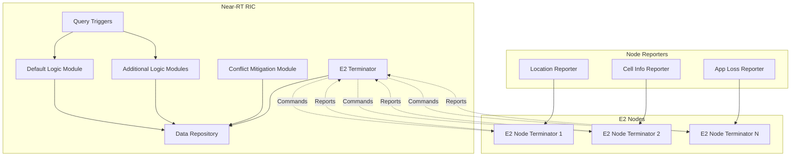

# O-RAN Module for ns-3

A comprehensive implementation of the O-RAN (Open Radio Access Network) architecture for the ns-3 network simulator, developed by NIST (National Institute of Standards and Technology).

## Table of Contents

- [Overview](#overview)
- [Features](#features)
- [Architecture](#architecture)
- [Prerequisites](#prerequisites)
- [Installation](#installation)
- [Quick Start](#quick-start)
- [Usage](#usage)
- [Examples](#examples)
- [API Documentation](#api-documentation)
- [Testing](#testing)
- [Contributing](#contributing)
- [License](#license)
- [Contact](#contact)

## Overview

The O-RAN module for ns-3 provides a complete implementation of the O-RAN architecture, enabling researchers and developers to simulate intelligent Radio Access Networks (RAN) with AI-driven optimization. This module includes a Near-Real Time RAN Intelligent Controller (Near-RT RIC) and associated E2 Node Terminators that facilitate communication between the RIC and simulation nodes.

The implementation focuses on providing infrastructure and data access capabilities while minimizing the complexity of interactions between models, allowing users to concentrate on developing their specific solutions and algorithms.

## Features

### Near-RT RIC Implementation

- **Data Repository**: Backend-agnostic data access API with SQLite implementation
- **Logic Modules (xApps)**: Support for default and additional logic modules
- **Conflict Mitigation**: API for resolving conflicts between multiple logic modules
- **Machine Learning Integration**: Support for ONNX Runtime and PyTorch models
- **Dynamic Module Management**: Addition and removal of logic modules during simulation
- **Processing Delay Simulation**: Configurable processing delays for realistic behavior

### E2 Node Capabilities

- **Periodic Reporting**: Automated metric collection and transmission to RIC
- **Event-Triggered Reports**: Configurable triggers for specific network events
- **Location Reporting**: Position tracking for any simulation node
- **LTE Cell Information**: Detailed reporting for LTE UE and eNB nodes
- **Keep-Alive Mechanism**: Node registration and health monitoring
- **Transmission Delay Simulation**: Realistic communication delays

### Communication and Control

- **LTE-to-LTE Handover**: Complete handover command generation and execution
- **Component Activation**: Individual control of RIC and node components
- **Virtual E2 Interface**: Efficient communication without protocol overhead
- **Command Processing**: End-to-end command lifecycle management

## Architecture

The O-RAN module implements a hierarchical architecture with clear separation of concerns:



### Component Overview

#### Near-RT RIC Components

- **Data Repository**: Stores reports, commands, and logs with SQLite backend
- **Logic Modules**: Implement decision-making algorithms (equivalent to xApps)
- **Conflict Mitigation**: Resolves conflicts between competing commands
- **E2 Terminator**: Manages communication with E2 nodes
- **Query Triggers**: Control when logic modules are invoked

#### E2 Node Components

- **E2 Node Terminators**: Interface between nodes and RIC
- **Reporters**: Collect and transmit node-specific metrics
- **Command Processors**: Execute commands received from RIC

## Prerequisites

### Required Dependencies

- **ns-3**: Version 3.30 or later
- **SQLite3**: Development libraries and headers
- **CMake**: Version 3.10 or later
- **C++ Compiler**: Supporting C++14 standard

### Optional Dependencies

- **LibTorch**: For PyTorch-based machine learning models
- **ONNX Runtime**: For ONNX model inference

### System Requirements

- **Operating System**: Linux (Ubuntu 18.04+), macOS, or Windows with WSL
- **Memory**: Minimum 4GB RAM recommended
- **Storage**: At least 2GB free space for compilation

## Installation

### 1. Clone the Repository

```bash
git clone https://github.com/sachin-deshik-10/ns3-oran.git
cd ns3-oran-master
```

### 2. Install System Dependencies

#### Ubuntu/Debian

```bash
sudo apt-get update
sudo apt-get install build-essential cmake sqlite3 libsqlite3-dev
```

#### CentOS/RHEL

```bash
sudo yum groupinstall "Development Tools"
sudo yum install cmake sqlite-devel
```

#### macOS

```bash
brew install cmake sqlite
```

### 3. Configure ns-3 Integration

Ensure this module is placed in the `contrib` directory of your ns-3 installation:

```bash
cp -r ns3-oran-master /path/to/ns3/contrib/oran
```

### 4. Build the Module

```bash
cd /path/to/ns3
./waf configure --enable-sqlite
./waf build
```

### 5. Verify Installation

```bash
./waf --run "oran-data-repository-example"
```

## Quick Start

### Basic Usage Example

```cpp
#include "ns3/oran-module.h"
#include "ns3/core-module.h"

using namespace ns3;

int main() {
    // Create nodes
    NodeContainer nodes;
    nodes.Create(3);
    
    // Configure O-RAN helper
    Ptr<OranHelper> oranHelper = CreateObject<OranHelper>();
    
    // Set up data repository
    oranHelper->SetDataRepository("ns3::OranDataRepositorySqlite",
                                  "DatabaseFile", 
                                  StringValue("example.db"));
    
    // Configure default logic module
    oranHelper->SetDefaultLogicModule("ns3::OranLmNoop");
    oranHelper->SetConflictMitigationModule("ns3::OranCmmNoop");
    
    // Create Near-RT RIC
    Ptr<OranNearRtRic> ric = oranHelper->CreateNearRtRic();
    
    // Deploy E2 terminators
    oranHelper->SetE2NodeTerminator("ns3::OranE2NodeTerminatorWired");
    oranHelper->AddReporter("ns3::OranReporterLocation",
                           "Trigger",
                           StringValue("ns3::OranReportTriggerPeriodic"));
    
    OranE2NodeTerminatorContainer terminators = 
        oranHelper->DeployTerminators(ric, nodes);
    
    // Activate components
    oranHelper->ActivateAndStartNearRtRic(ric);
    oranHelper->ActivateE2NodeTerminators(terminators);
    
    // Run simulation
    Simulator::Stop(Seconds(10));
    Simulator::Run();
    Simulator::Destroy();
    
    return 0;
}
```

## Usage

### Configuration Workflow

The typical workflow for using the O-RAN module follows these steps:


### 1. Helper Configuration

```cpp
Ptr<OranHelper> oranHelper = CreateObject<OranHelper>();
oranHelper->SetAttribute("Verbose", BooleanValue(true));
oranHelper->SetAttribute("LmQueryInterval", TimeValue(Seconds(5)));
```

### 2. Data Repository Setup

```cpp
oranHelper->SetDataRepository("ns3::OranDataRepositorySqlite",
                              "DatabaseFile", StringValue("simulation.db"));
```

### 3. Logic Module Configuration

```cpp
// Default logic module (required)
oranHelper->SetDefaultLogicModule("ns3::OranLmLte2LteDistanceHandover",
                                  "ProcessingDelayRv",
                                  StringValue("ns3::ConstantRandomVariable[Constant=0.1]"));

// Additional logic modules (optional)
oranHelper->AddLogicModule("CustomLM", "ns3::OranLmCustom");
```

### 4. E2 Node Configuration

```cpp
oranHelper->SetE2NodeTerminator("ns3::OranE2NodeTerminatorLteUe",
                                "RegistrationIntervalRv",
                                StringValue("ns3::ConstantRandomVariable[Constant=1]"));

oranHelper->AddReporter("ns3::OranReporterLteUeCellInfo",
                        "Trigger",
                        StringValue("ns3::OranReportTriggerLteUeHandover"));
```

### Advanced Configuration

#### Machine Learning Integration

```cpp
// PyTorch model
oranHelper->SetDefaultLogicModule("ns3::OranLmLte2LteTorchHandover",
                                  "ModelPath", StringValue("model.pt"));

// ONNX model
oranHelper->SetDefaultLogicModule("ns3::OranLmLte2LteOnnxHandover",
                                  "ModelPath", StringValue("model.onnx"));
```

#### Custom Query Triggers

```cpp
oranHelper->AddQueryTrigger("CustomTrigger",
                           "ns3::OranQueryTriggerCustom",
                           "CustomCallback",
                           CallbackValue(MakeCallback(&MyTriggerCallback)));
```

## Examples

The module includes several comprehensive examples:

### Basic Examples

- **oran-data-repository-example**: Demonstrates data storage and retrieval
- **oran-keep-alive-example**: Shows E2 node registration and monitoring
- **oran-random-walk-example**: Basic location reporting with mobile nodes

### LTE Handover Examples

- **oran-lte-2-lte-distance-handover-example**: Distance-based handover decisions
- **oran-lte-2-lte-rsrp-handover-lm-example**: RSRP-based handover logic
- **oran-lte-2-lte-ml-handover-example**: Machine learning-driven handovers

### Advanced Examples

- **oran-multiple-net-devices-example**: Multi-interface node handling
- **oran-lte-2-lte-distance-handover-lm-processing-delay-example**: Processing delay impact
- **oran-lte-2-lte-distance-handover-lm-query-trigger-example**: Custom trigger implementation

### Running Examples

```bash
# Basic data repository example
./waf --run "oran-data-repository-example"

# LTE handover with ML
./waf --run "oran-lte-2-lte-ml-handover-example --modelType=torch"

# Multiple network devices
./waf --run "oran-multiple-net-devices-example --numUes=10 --numEnbs=3"
```

### Example Parameters

Most examples support command-line parameters:

```bash
./waf --run "oran-lte-2-lte-distance-handover-example \
    --dbFileName=handover.db \
    --simTime=60 \
    --verbose=true \
    --handoverThreshold=50"
```

## API Documentation

### Core Classes

#### OranHelper

Central configuration and deployment helper for O-RAN components.

```cpp
class OranHelper : public Object {
public:
    // Configuration methods
    void SetDataRepository(std::string type, ...);
    void SetDefaultLogicModule(std::string type, ...);
    void SetConflictMitigationModule(std::string type, ...);
    
    // Deployment methods
    Ptr<OranNearRtRic> CreateNearRtRic();
    OranE2NodeTerminatorContainer DeployTerminators(Ptr<OranNearRtRic> ric, 
                                                     NodeContainer nodes);
    
    // Lifecycle management
    void ActivateAndStartNearRtRic(Ptr<OranNearRtRic> ric);
    void ActivateE2NodeTerminators(OranE2NodeTerminatorContainer terminators);
};
```

#### OranNearRtRic

Near-Real Time RAN Intelligent Controller implementation.

```cpp
class OranNearRtRic : public Object {
public:
    // Component access
    Ptr<OranDataRepository> Data() const;
    Ptr<OranLm> GetDefaultLogicModule() const;
    Ptr<OranCmm> GetConflictMitigationModule() const;
    
    // Lifecycle management
    void Activate();
    void Deactivate();
    void Start();
    void Stop();
    
    // Logic module management
    void SetDefaultLogicModule(Ptr<OranLm> lm);
    void AddLogicModule(std::string name, Ptr<OranLm> lm);
    void RemoveLogicModule(std::string name);
};
```

#### OranDataRepository

Abstract interface for data storage operations.

```cpp
class OranDataRepository : public Object {
public:
    // Node management
    virtual uint64_t RegisterE2Node(Ptr<OranE2NodeTerminator> terminator) = 0;
    virtual void DeregisterE2Node(uint64_t nodeId) = 0;
    
    // Report storage
    virtual void StoreReport(Ptr<OranReport> report) = 0;
    virtual std::vector<Ptr<OranReport>> GetReports(/* filters */) = 0;
    
    // Command storage
    virtual void StoreCommand(Ptr<OranCommand> command) = 0;
    virtual std::vector<Ptr<OranCommand>> GetCommands(/* filters */) = 0;
};
```

### Reporter Classes

#### OranReporter

Base class for all reporter implementations.

```cpp
class OranReporter : public Object {
public:
    // Lifecycle
    void Activate();
    void Deactivate();
    
    // Configuration
    void SetTrigger(Ptr<OranReportTrigger> trigger);
    void SetE2Terminator(Ptr<OranE2NodeTerminator> terminator);
    
protected:
    // Override in derived classes
    virtual Ptr<OranReport> GenerateReport() = 0;
};
```

### Logic Module Classes

#### OranLm

Base class for logic module implementations.

```cpp
class OranLm : public Object {
public:
    // Main processing method
    virtual std::vector<Ptr<OranCommand>> Logic(
        std::vector<Ptr<OranReport>> reports) = 0;
    
    // Configuration
    void SetRic(Ptr<OranNearRtRic> ric);
    void SetProcessingDelay(Time delay);
    
protected:
    // Utility methods
    Ptr<OranDataRepository> GetDataRepository();
    std::vector<Ptr<OranReport>> GetRecentReports(Time timeWindow);
};
```

## Testing

### Unit Tests

Run the complete test suite:

```bash
./waf --run "test-runner --suite=oran"
```

### Individual Test Cases

```bash
# Test data repository functionality
./waf --run "test-runner --suite=oran --test-case=oran-data-repository"

# Test Near-RT RIC lifecycle
./waf --run "test-runner --suite=oran --test-case=oran-near-rt-ric"

# Test reporter functionality
./waf --run "test-runner --suite=oran --test-case=oran-reporter"
```

### Test Coverage

Generate coverage reports:

```bash
./waf configure --enable-gcov
./waf build
./waf --run "test-runner --suite=oran"
gcovr -r . --html --html-details -o coverage.html
```

### Performance Testing

Benchmark example for performance evaluation:

```bash
./waf --run "oran-performance-test --numNodes=100 --duration=300"
```

## Contributing

We welcome contributions to the O-RAN module! Please follow these guidelines:

### Development Setup

1. Fork the repository
2. Create a feature branch: `git checkout -b feature/your-feature`
3. Make your changes following the coding standards
4. Add tests for new functionality
5. Ensure all tests pass: `./waf --run "test-runner --suite=oran"`
6. Submit a pull request

### Coding Standards

- Follow ns-3 coding conventions
- Use consistent indentation (2 spaces)
- Include comprehensive documentation for public APIs
- Add unit tests for new features
- Maintain backward compatibility when possible

### Submitting Issues

When reporting bugs or requesting features:

1. Check existing issues first
2. Provide clear reproduction steps
3. Include system information and versions
4. Attach relevant log files or examples

### Documentation

- Update README.md for user-facing changes
- Add API documentation for new classes
- Include examples for new features
- Update architecture diagrams if needed

## License

This software is developed by NIST (National Institute of Standards and Technology) and is provided as a public service. The software is expressly provided "AS IS" and comes with no warranty of any kind.

Key license points:

- Free to use, copy, and distribute
- Modifications are allowed and encouraged
- Must maintain attribution to NIST
- No warranty or liability from NIST
- Not subject to copyright protection within the United States

For complete license terms, see [LICENSE.md](LICENSE.md).

## Contact

### Support

- **Issues**: Report bugs and request features via GitHub Issues
- **Documentation**: Comprehensive docs available in the `doc/` directory
- **Examples**: See `examples/` directory for usage patterns

### Development Team

This module is developed and maintained by:

- **NIST Communications Technology Laboratory**
- **Wireless Networks Division**

### Academic Citations

If you use this module in academic research, please cite:

```bibtex
@misc{nist-oran-ns3,
  title={O-RAN Module for ns-3 Network Simulator},
  author={NIST Communications Technology Laboratory},
  institution={National Institute of Standards and Technology},
  year={2024},
  url={https://github.com/your-org/ns3-oran-master}
}
```

### Related Projects

- [ns-3 Network Simulator](https://www.nsnam.org/)
- [O-RAN Alliance](https://www.o-ran.org/)
- [NIST 5G Testbed](https://www.nist.gov/communications-technology-laboratory)

---

**Disclaimer**: This software is provided by NIST as a public service. NIST makes no warranty of any kind and accepts no responsibility for its use or reliability.
