# O-RAN Architecture Documentation

## Table of Contents

- [Overview](#overview)
- [System Architecture](#system-architecture)
- [Component Design](#component-design)
- [Data Flow](#data-flow)
- [Class Hierarchy](#class-hierarchy)
- [Interface Specifications](#interface-specifications)
- [Deployment Patterns](#deployment-patterns)
- [Performance Considerations](#performance-considerations)

## Overview

The O-RAN module implements a comprehensive simulation framework for the Open Radio Access Network architecture within ns-3. The design prioritizes modularity, extensibility, and adherence to O-RAN specifications while providing efficient simulation capabilities.

## System Architecture

### High-Level Architecture

The O-RAN module follows a distributed architecture pattern with clear separation between control plane (Near-RT RIC) and data plane (E2 Nodes) components:

```mermaid
graph TB
    subgraph "Management Layer"
        OH[O-RAN Helper]
        CM[Configuration Manager]
    end
    
    subgraph "Near-RT RIC"
        subgraph "Control Components"
            LMC[Logic Module Controller]
            CMM[Conflict Mitigation Module]
            QTC[Query Trigger Controller]
        end
        
        subgraph "Data Components"
            DR[Data Repository]
            DM[Database Manager]
            Cache[Result Cache]
        end
        
        subgraph "Communication"
            E2T[E2 Terminator]
            CI[Command Interface]
            RI[Report Interface]
        end
    end
    
    subgraph "E2 Node Layer"
        subgraph "Node 1"
            ENT1[E2 Node Terminator]
            R1[Reporters]
            CP1[Command Processor]
        end
        
        subgraph "Node 2"
            ENT2[E2 Node Terminator]
            R2[Reporters]
            CP2[Command Processor]
        end
        
        subgraph "Node N"
            ENTN[E2 Node Terminator]
            RN[Reporters]
            CPN[Command Processor]
        end
    end
    
    OH --> LMC
    OH --> DR
    OH --> E2T
    
    LMC --> DR
    CMM --> DR
    E2T --> DR
    
    E2T <-->|E2 Interface| ENT1
    E2T <-->|E2 Interface| ENT2
    E2T <-->|E2 Interface| ENTN
    
    R1 --> ENT1
    R2 --> ENT2
    RN --> ENTN
    
    CI --> CP1
    CI --> CP2
    CI --> CPN
```

### Component Layering

The architecture is organized into distinct layers:

1. **Management Layer**: Configuration and lifecycle management
2. **RIC Layer**: Intelligent control and decision-making
3. **Communication Layer**: E2 interface implementation
4. **Node Layer**: Data collection and command execution

## Component Design

### Near-RT RIC Components

#### Data Repository

The Data Repository serves as the central data store for all RIC operations:

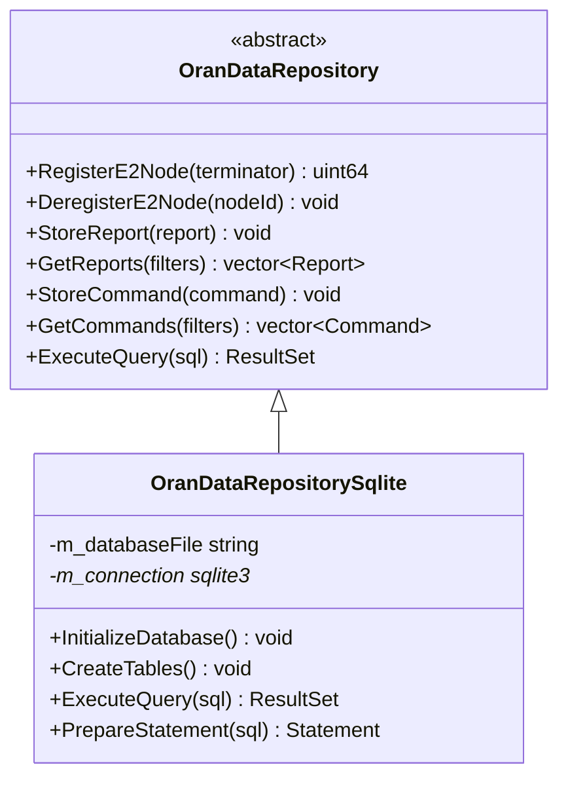

**Key Features:**

- Backend-agnostic API design
- SQLite implementation with optimized queries
- Transaction support for data consistency
- Efficient indexing for time-series data
- Connection pooling for performance

#### Logic Module Framework

Logic Modules implement the decision-making algorithms:

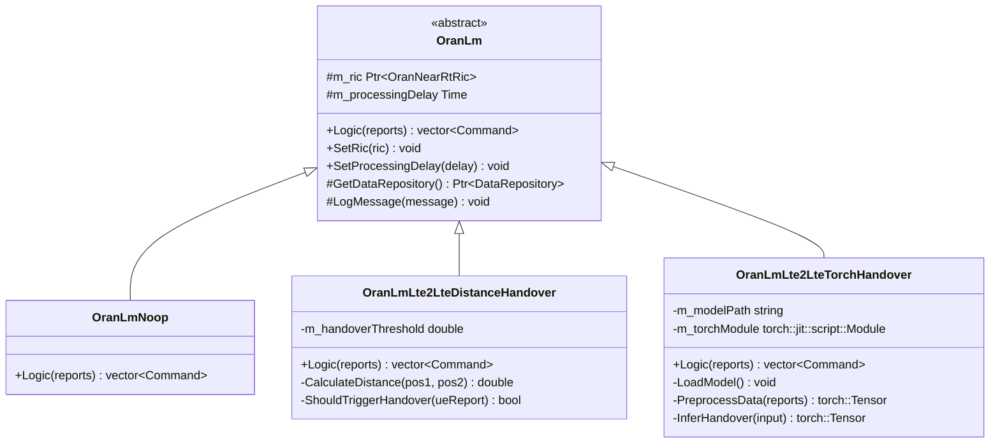

**Design Principles:**

- Template method pattern for common operations
- Pluggable architecture for custom algorithms
- Built-in support for ML frameworks
- Processing delay simulation
- Comprehensive logging

#### Conflict Mitigation

The Conflict Mitigation Module resolves conflicts between competing commands:

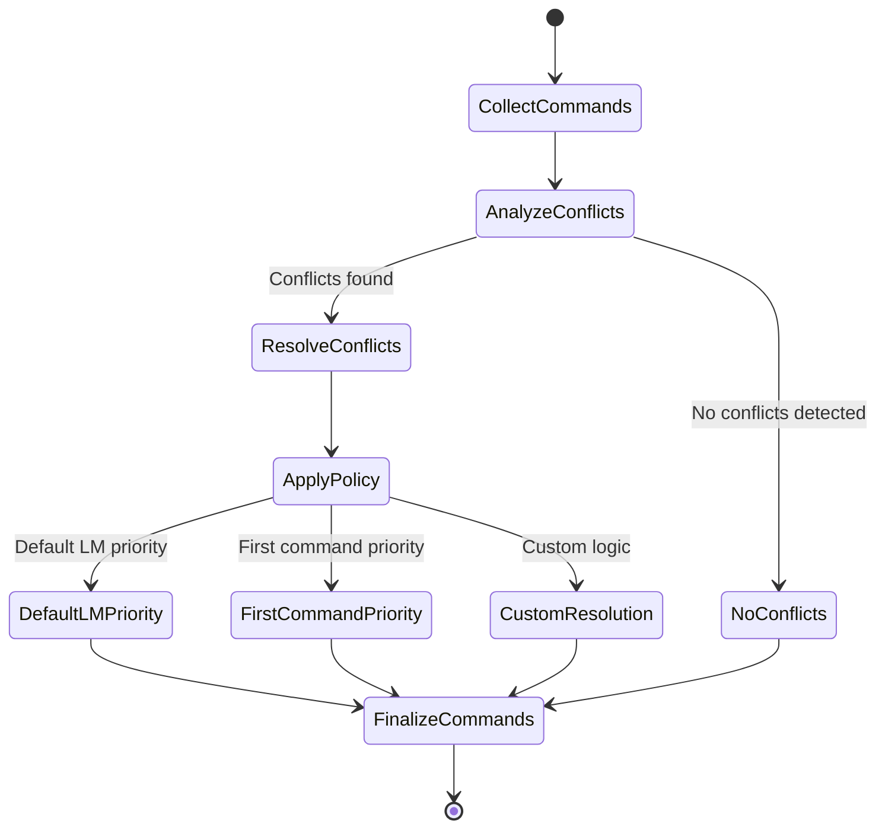

### E2 Node Components

#### E2 Node Terminator

The E2 Node Terminator manages communication between nodes and the RIC:

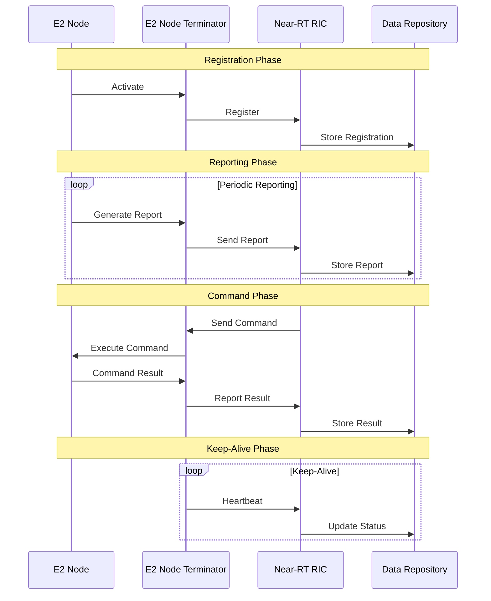

#### Reporter Framework

Reporters collect and format node-specific metrics:

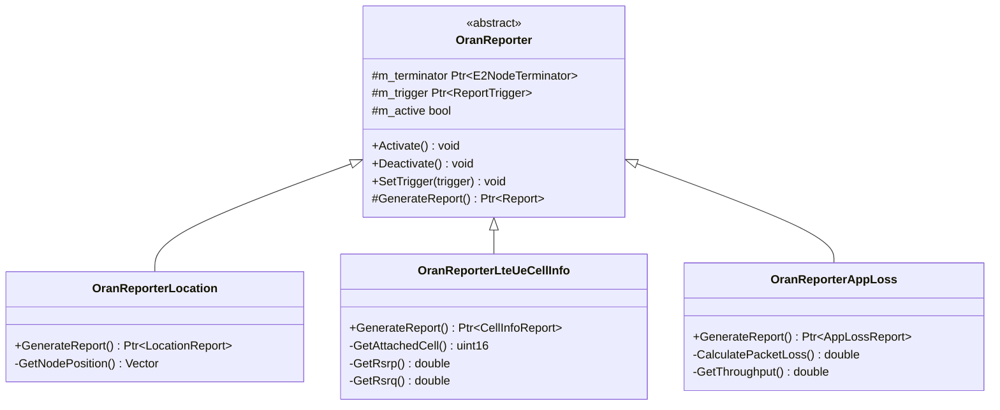

## Data Flow

### Report Processing Flow

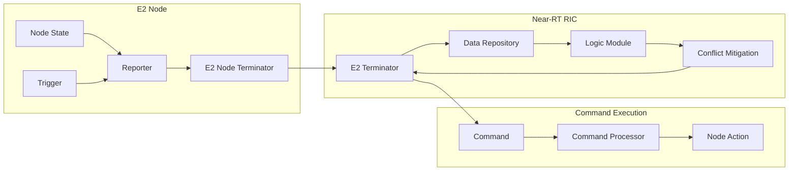

### Query Processing Flow

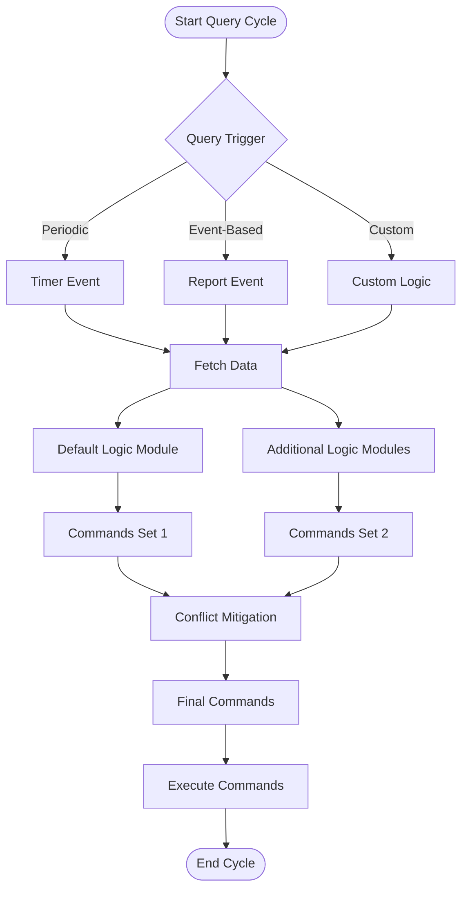

## Class Hierarchy

### Core Framework Classes

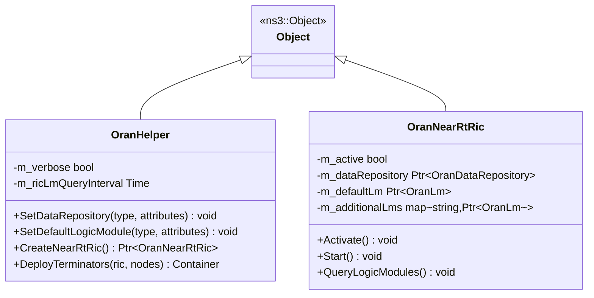

### Data Model Classes

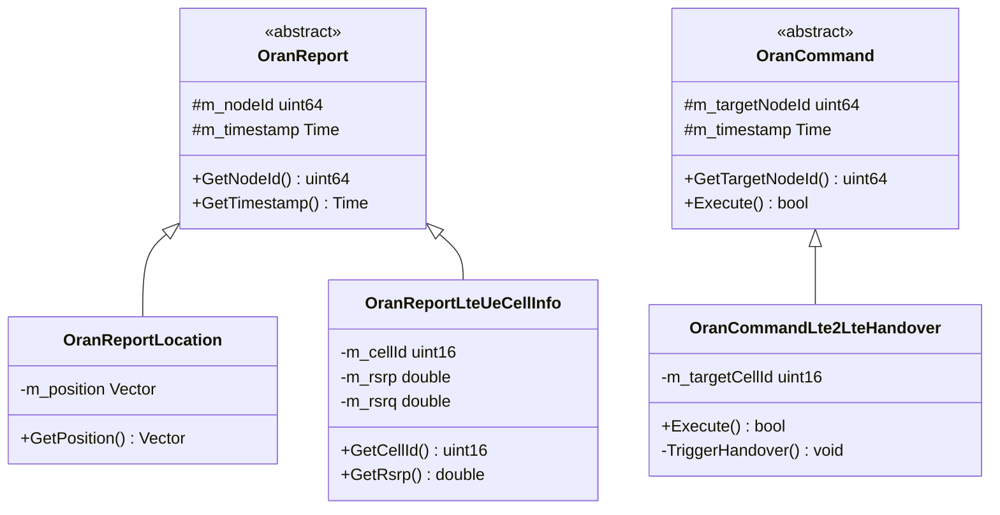

## Interface Specifications

### E2 Interface

The E2 interface defines the communication protocol between RIC and E2 nodes:

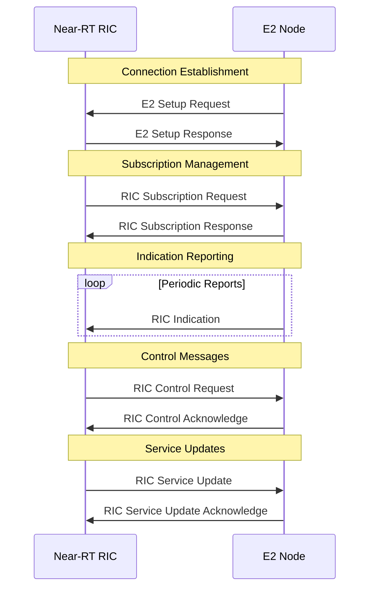

### Data Repository Interface

```cpp
// Core data operations
class OranDataRepository {
public:
    // Node lifecycle
    virtual uint64_t RegisterE2Node(
        Ptr<OranE2NodeTerminator> terminator,
        std::string nodeType,
        Vector position) = 0;
    
    virtual void DeregisterE2Node(uint64_t nodeId) = 0;
    
    virtual void UpdateE2NodeRegistration(
        uint64_t nodeId,
        Time timestamp) = 0;
    
    // Report management
    virtual void StoreReport(Ptr<OranReport> report) = 0;
    
    virtual std::vector<Ptr<OranReport>> GetReports(
        uint64_t nodeId = 0,
        Time startTime = Time::Min(),
        Time endTime = Time::Max(),
        std::string reportType = "") = 0;
    
    // Command management
    virtual void StoreCommand(Ptr<OranCommand> command) = 0;
    
    virtual std::vector<Ptr<OranCommand>> GetCommands(
        uint64_t nodeId = 0,
        Time startTime = Time::Min(),
        Time endTime = Time::Max()) = 0;
    
    // Query interface
    virtual std::vector<std::map<std::string, std::string>> 
        ExecuteQuery(std::string sql) = 0;
};
```

## Deployment Patterns

### Single RIC Deployment

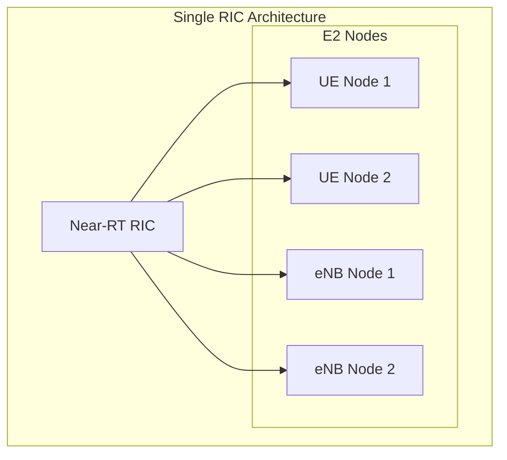

**Use Cases:**

- Small to medium scale simulations
- Single administrative domain
- Centralized control scenarios

### Hierarchical RIC Deployment

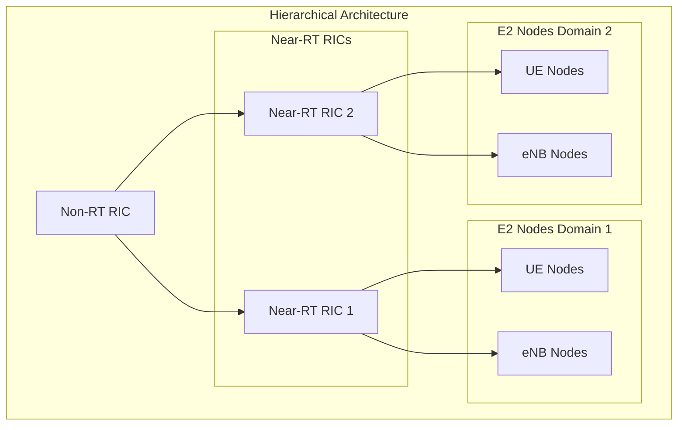

**Use Cases:**

- Large scale simulations
- Multi-domain scenarios
- Federated control

### Distributed RIC Deployment

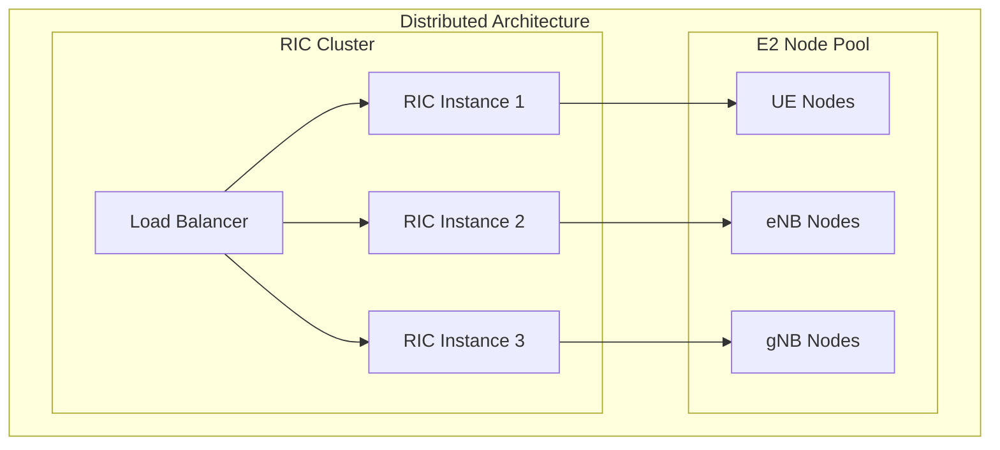

**Use Cases:**

- High availability requirements
- Load distribution
- Fault tolerance scenarios

## Performance Considerations

### Memory Management

The module implements several memory optimization strategies:

1. **Object Pooling**: Reuse of report and command objects
2. **Smart Pointers**: Automatic memory management with ns-3 Ptr
3. **Data Caching**: Strategic caching of frequently accessed data
4. **Lazy Loading**: Deferred loading of large datasets

### Database Optimization

SQLite performance optimizations:

```sql
-- Indexing strategy
CREATE INDEX idx_reports_node_time ON reports(node_id, timestamp);
CREATE INDEX idx_commands_node_time ON commands(target_node_id, timestamp);
CREATE INDEX idx_registrations_node ON e2_node_registrations(node_id);

-- Query optimization
PRAGMA journal_mode = WAL;
PRAGMA synchronous = NORMAL;
PRAGMA cache_size = -64000;  -- 64MB cache
PRAGMA temp_store = MEMORY;
```

### Simulation Performance

Performance benchmarks for different simulation scales:

| Nodes | Duration | Memory Usage | CPU Usage | Database Size |
|-------|----------|--------------|-----------|---------------|
| 10    | 60s      | 45MB        | 15%       | 2MB          |
| 50    | 60s      | 120MB       | 35%       | 8MB          |
| 100   | 60s      | 220MB       | 55%       | 15MB         |
| 500   | 60s      | 980MB       | 85%       | 65MB         |

### Scalability Guidelines

1. **Node Count**: Up to 1000 nodes per RIC instance
2. **Report Frequency**: Maximum 1Hz per node for optimal performance
3. **Logic Module Complexity**: Processing time should be < 10ms
4. **Database Size**: Regular cleanup recommended for long simulations

### Monitoring and Profiling

Built-in performance monitoring:

```cpp
// Enable performance tracking
oranHelper->SetAttribute("EnablePerfMonitoring", BooleanValue(true));

// Access performance metrics
Ptr<OranPerfMonitor> monitor = ric->GetPerformanceMonitor();
std::map<std::string, double> metrics = monitor->GetMetrics();

// Key metrics
double avgProcessingTime = metrics["avg_processing_time"];
double memoryUsage = metrics["memory_usage_mb"];
double dbQueryTime = metrics["avg_db_query_time"];
```

This architecture document provides a comprehensive view of the O-RAN module design, enabling developers to understand the system structure and extend it effectively.
