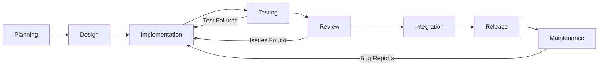
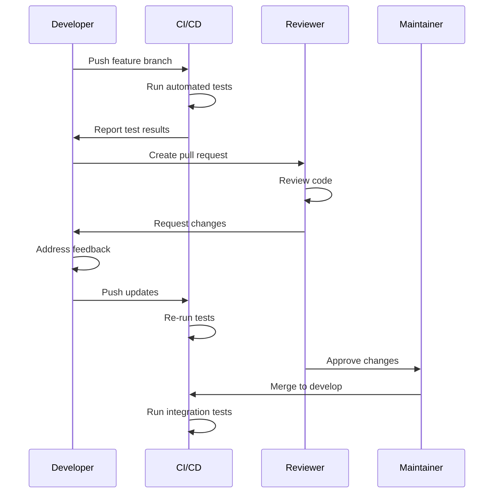
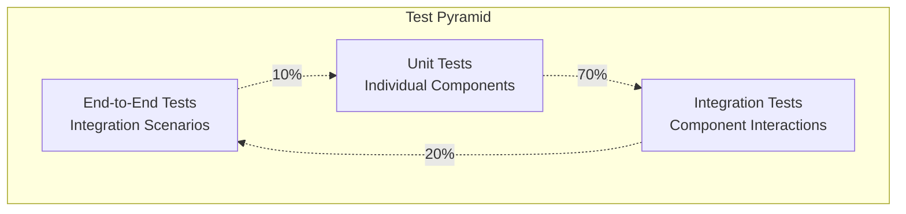
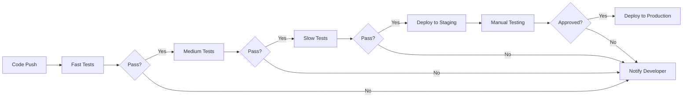
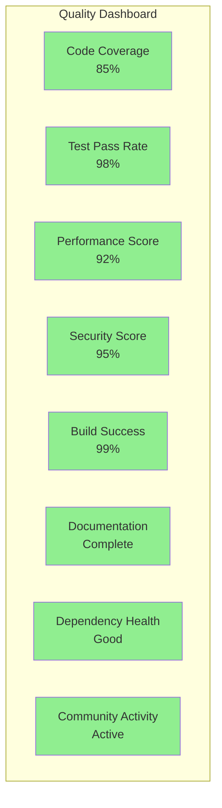

# Development Workflow Guide

## Table of Contents

- [Overview](#overview)
- [Development Process](#development-process)
- [Code Workflow](#code-workflow)
- [Testing Workflow](#testing-workflow)
- [Release Workflow](#release-workflow)
- [Integration Workflow](#integration-workflow)
- [Quality Assurance](#quality-assurance)

## Overview

This document outlines the development workflow for the O-RAN Module for ns-3, providing a structured approach to development, testing, and release management.

## Development Process

### Project Lifecycle



### Development Phases

#### 1. Planning Phase

**Duration**: 1-2 weeks

**Activities**:

- Requirements gathering and analysis
- Feature specification and documentation
- Architecture design and review
- Resource allocation and timeline planning

**Deliverables**:

- Feature specification document
- Architecture design diagrams
- Implementation timeline
- Resource allocation plan

#### 2. Design Phase

**Duration**: 1 week

**Activities**:

- Detailed component design
- API specification
- Database schema updates
- Interface definition

**Deliverables**:

- Detailed design documents
- API specifications
- Database migration scripts
- Interface contracts

#### 3. Implementation Phase

**Duration**: 2-4 weeks

**Activities**:

- Core functionality implementation
- Unit test development
- Documentation writing
- Code review preparation

**Deliverables**:

- Implemented features
- Unit tests
- API documentation
- Code review materials

#### 4. Testing Phase

**Duration**: 1-2 weeks

**Activities**:

- Integration testing
- Performance testing
- Security testing
- User acceptance testing

**Deliverables**:

- Test reports
- Performance benchmarks
- Security assessment
- Bug reports and fixes

#### 5. Review Phase

**Duration**: 1 week

**Activities**:

- Code review
- Documentation review
- Architecture review
- Security review

**Deliverables**:

- Review reports
- Approved changes
- Documentation updates
- Security clearance

## Code Workflow

### Branch Strategy

```mermaid
gitgraph
    commit id: "Initial"
    branch develop
    checkout develop
    commit id: "Setup"
    
    branch feature/new-lm
    checkout feature/new-lm
    commit id: "Implement LM"
    commit id: "Add tests"
    commit id: "Documentation"
    
    checkout develop
    merge feature/new-lm
    
    branch release/v1.3.0
    checkout release/v1.3.0
    commit id: "Prepare release"
    commit id: "Bug fixes"
    
    checkout main
    merge release/v1.3.0
    tag: "v1.3.0"
    
    checkout develop
    merge release/v1.3.0
```

### Branch Types

#### Main Branch

- **Purpose**: Production-ready code
- **Protection**: Direct pushes disabled
- **Merges**: Only from release branches
- **Policies**: Requires review and CI success

#### Develop Branch

- **Purpose**: Integration branch for features
- **Protection**: Direct pushes limited
- **Merges**: From feature and hotfix branches
- **Policies**: Requires CI success

#### Feature Branches

- **Naming**: `feature/description` or `feature/issue-number`
- **Source**: develop branch
- **Target**: develop branch
- **Lifetime**: Duration of feature development

#### Release Branches

- **Naming**: `release/vX.Y.Z`
- **Source**: develop branch
- **Target**: main and develop branches
- **Purpose**: Release preparation and bug fixes

#### Hotfix Branches

- **Naming**: `hotfix/description`
- **Source**: main branch
- **Target**: main and develop branches
- **Purpose**: Critical bug fixes in production

### Development Steps

#### 1. Feature Development

```bash
# Start new feature
git checkout develop
git pull origin develop
git checkout -b feature/new-logic-module

# Development cycle
while [ development_not_complete ]; do
    # Write code
    vim src/model/oran-lm-new.cc
    
    # Write tests
    vim test/oran-lm-new-test-suite.cc
    
    # Local testing
    ./waf configure --enable-tests
    ./waf build
    ./waf --run "test-runner --suite=oran-lm-new"
    
    # Commit changes
    git add .
    git commit -m "feat(lm): implement new logic module functionality"
done

# Push feature branch
git push origin feature/new-logic-module
```

#### 2. Code Review Process



#### 3. Integration Process

```bash
# Integration testing
git checkout develop
git pull origin develop

# Run full test suite
./waf configure --enable-tests --enable-static
./waf build
./waf --run "test-runner"

# Performance testing
./waf --run "oran-performance-test --nodes=1000 --duration=300"

# Memory leak testing
valgrind --tool=memcheck --leak-check=full \
    ./waf --run "oran-integration-test"
```

## Testing Workflow

### Test Pyramid Structure



### Testing Levels

#### 1. Unit Tests

**Purpose**: Test individual components in isolation

**Coverage**: All public methods and core functionality

**Execution**: Fast, automated, isolated

```cpp
// Example unit test
class OranLmDistanceHandoverTest : public TestCase
{
public:
    OranLmDistanceHandoverTest() 
        : TestCase("Distance handover logic validation") {}

private:
    void DoRun() override {
        // Test setup
        Ptr<OranLmLte2LteDistanceHandover> lm = 
            CreateObject<OranLmLte2LteDistanceHandover>();
        lm->SetAttribute("HandoverThreshold", DoubleValue(100.0));
        
        // Create test reports
        std::vector<Ptr<OranReport>> reports;
        reports.push_back(CreateLocationReport(1, Vector(150, 0, 0)));
        reports.push_back(CreateCellInfoReport(1, 1));
        
        // Execute logic
        auto commands = lm->Logic(reports);
        
        // Validate results
        NS_TEST_ASSERT_MSG_EQ(commands.size(), 1, 
                             "Should generate handover command");
        
        auto handoverCmd = DynamicCast<OranCommandLte2LteHandover>(commands[0]);
        NS_TEST_ASSERT_MSG_NE(handoverCmd, nullptr, 
                             "Command should be handover type");
    }
};
```

#### 2. Integration Tests

**Purpose**: Test component interactions and data flow

**Coverage**: End-to-end scenarios and interfaces

**Execution**: Moderate speed, realistic scenarios

```cpp
// Example integration test
class OranEndToEndTest : public TestCase
{
private:
    void DoRun() override {
        // Set up complete simulation
        NodeContainer ueNodes;
        ueNodes.Create(5);
        
        NodeContainer enbNodes;
        enbNodes.Create(2);
        
        // Configure LTE network
        SetupLteNetwork(ueNodes, enbNodes);
        
        // Configure O-RAN components
        Ptr<OranHelper> helper = CreateObject<OranHelper>();
        helper->SetDefaultLogicModule("ns3::OranLmLte2LteDistanceHandover");
        
        Ptr<OranNearRtRic> ric = helper->CreateNearRtRic();
        auto terminators = helper->DeployTerminators(ric, ueNodes);
        
        // Set up validation
        std::vector<Ptr<OranCommand>> capturedCommands;
        ric->Data()->TraceConnectWithoutContext(
            "StoreCommand",
            MakeCallback(&CaptureCommands, &capturedCommands));
        
        // Run simulation
        Simulator::Stop(Seconds(60));
        Simulator::Run();
        
        // Validate results
        NS_TEST_ASSERT_MSG_GT(capturedCommands.size(), 0,
                             "Should generate commands during simulation");
        
        ValidateHandoverSequence(capturedCommands);
        
        Simulator::Destroy();
    }
};
```

#### 3. Performance Tests

**Purpose**: Validate performance requirements and benchmarks

**Coverage**: Scalability, throughput, latency

**Execution**: Longer duration, resource intensive

```cpp
// Example performance test
class OranPerformanceTest : public TestCase
{
private:
    void DoRun() override {
        const uint32_t nodeCount = 1000;
        const Time simDuration = Seconds(300);
        
        // Large scale setup
        NodeContainer nodes;
        nodes.Create(nodeCount);
        
        // Configure with performance settings
        Ptr<OranHelper> helper = CreateObject<OranHelper>();
        helper->SetAttribute("LmQueryInterval", TimeValue(Seconds(10)));
        helper->SetDataRepository("ns3::OranDataRepositorySqlite",
                                  "PragmaJournalMode", StringValue("WAL"),
                                  "PragmaCacheSize", UintegerValue(64000));
        
        // Measure setup time
        auto startTime = std::chrono::high_resolution_clock::now();
        
        Ptr<OranNearRtRic> ric = helper->CreateNearRtRic();
        auto terminators = helper->DeployTerminators(ric, nodes);
        
        // Activate and run
        helper->ActivateAndStartNearRtRic(ric);
        helper->ActivateE2NodeTerminators(terminators);
        
        Simulator::Stop(simDuration);
        Simulator::Run();
        
        auto endTime = std::chrono::high_resolution_clock::now();
        auto duration = std::chrono::duration_cast<std::chrono::seconds>(
            endTime - startTime);
        
        // Performance assertions
        NS_TEST_ASSERT_MSG_LT(duration.count(), 600,
                             "Simulation should complete within 10 minutes");
        
        // Memory usage check
        auto memUsage = GetMemoryUsage();
        NS_TEST_ASSERT_MSG_LT(memUsage, 2000,
                             "Memory usage should be under 2GB");
        
        Simulator::Destroy();
    }
};
```

### Test Automation

#### Continuous Integration Pipeline

```yaml
# .github/workflows/ci.yml
name: CI

on:
  push:
    branches: [ main, develop ]
  pull_request:
    branches: [ main, develop ]

jobs:
  test:
    runs-on: ubuntu-latest
    
    strategy:
      matrix:
        ns3_version: [3.35, 3.36, 3.37]
        build_type: [Debug, Release]
    
    steps:
    - uses: actions/checkout@v3
    
    - name: Install dependencies
      run: |
        sudo apt-get update
        sudo apt-get install build-essential cmake sqlite3 libsqlite3-dev
    
    - name: Setup ns-3
      run: |
        wget https://gitlab.com/nsnam/ns-3-dev/-/archive/ns-${{ matrix.ns3_version }}/ns-3-dev-ns-${{ matrix.ns3_version }}.tar.gz
        tar -xzf ns-3-dev-ns-${{ matrix.ns3_version }}.tar.gz
        mv ns-3-dev-ns-${{ matrix.ns3_version }} ns-3
        cp -r . ns-3/contrib/oran
    
    - name: Configure build
      run: |
        cd ns-3
        ./waf configure --enable-tests --build-type=${{ matrix.build_type }}
    
    - name: Build
      run: |
        cd ns-3
        ./waf build
    
    - name: Run tests
      run: |
        cd ns-3
        ./waf --run "test-runner --suite=oran"
    
    - name: Run examples
      run: |
        cd ns-3
        ./waf --run "oran-data-repository-example"
        ./waf --run "oran-lte-2-lte-distance-handover-example"
```

## Release Workflow

### Release Planning

#### Version Numbering

We follow Semantic Versioning (MAJOR.MINOR.PATCH):

- **MAJOR**: Incompatible API changes
- **MINOR**: New functionality in backward-compatible manner
- **PATCH**: Backward-compatible bug fixes

#### Release Types

**Major Release (X.0.0)**:

- Significant architectural changes
- Breaking API changes
- New major features
- 6-month cycle

**Minor Release (X.Y.0)**:

- New features and capabilities
- API additions (backward compatible)
- Performance improvements
- 3-month cycle

**Patch Release (X.Y.Z)**:

- Bug fixes
- Security updates
- Documentation corrections
- As needed

### Release Process

#### 1. Release Preparation

```bash
# Create release branch
git checkout develop
git pull origin develop
git checkout -b release/v1.3.0

# Update version numbers
vim CMakeLists.txt  # Update VERSION
vim src/model/oran-module.h  # Update MODULE_VERSION

# Update documentation
vim CHANGELOG.md
vim README.md
vim docs/API_REFERENCE.md

# Run full test suite
./waf configure --enable-tests
./waf build
./waf --run "test-runner"

# Performance benchmarks
./waf --run "oran-performance-test"

# Generate documentation
doxygen docs/Doxyfile
```

#### 2. Release Validation

```bash
# Multi-platform testing
for platform in ubuntu-18.04 ubuntu-20.04 ubuntu-22.04 centos-8; do
    docker run --rm -v $(pwd):/workspace $platform \
        /workspace/scripts/test-platform.sh
done

# Memory leak testing
valgrind --tool=memcheck --leak-check=full \
    ./waf --run "oran-integration-test"

# Performance regression testing
./scripts/performance-comparison.sh v1.2.0 release/v1.3.0

# Security scanning
clang-static-analyzer src/
cppcheck --enable=all src/
```

#### 3. Release Deployment

```bash
# Merge to main
git checkout main
git merge --no-ff release/v1.3.0

# Create release tag
git tag -a v1.3.0 -m "Release version 1.3.0"

# Merge back to develop
git checkout develop
git merge --no-ff release/v1.3.0

# Push changes
git push origin main develop --tags

# Clean up release branch
git branch -d release/v1.3.0
git push origin --delete release/v1.3.0
```

#### 4. Release Artifacts

```bash
# Create release package
./scripts/create-release-package.sh v1.3.0

# Generate checksums
sha256sum ns3-oran-v1.3.0.tar.gz > ns3-oran-v1.3.0.tar.gz.sha256

# Upload to releases
gh release create v1.3.0 \
    --title "O-RAN Module v1.3.0" \
    --notes-file RELEASE_NOTES.md \
    ns3-oran-v1.3.0.tar.gz \
    ns3-oran-v1.3.0.tar.gz.sha256
```

## Integration Workflow

### Continuous Integration

#### Build Matrix

| Platform | ns-3 Version | Compiler | Build Type | ML Support |
|----------|--------------|----------|------------|------------|
| Ubuntu 18.04 | 3.35 | GCC 8 | Debug | No |
| Ubuntu 18.04 | 3.35 | GCC 8 | Release | No |
| Ubuntu 20.04 | 3.36 | GCC 9 | Debug | Yes |
| Ubuntu 20.04 | 3.36 | GCC 9 | Release | Yes |
| Ubuntu 22.04 | 3.37 | GCC 11 | Debug | Yes |
| Ubuntu 22.04 | 3.37 | GCC 11 | Release | Yes |

#### Test Categories

**Fast Tests** (< 5 minutes):

- Unit tests
- Code style checks
- Documentation generation
- Basic integration tests

**Medium Tests** (5-30 minutes):

- Full integration tests
- Example simulations
- Memory leak detection
- Cross-platform builds

**Slow Tests** (30+ minutes):

- Performance benchmarks
- Large-scale simulations
- Security scans
- Compatibility testing

### Deployment Pipeline



## Quality Assurance

### Code Quality Gates

#### 1. Code Coverage

**Minimum Requirements**:

- Unit test coverage: ≥ 80%
- Integration test coverage: ≥ 60%
- Overall coverage: ≥ 75%

**Measurement**:

```bash
# Generate coverage report
cmake .. -DCMAKE_BUILD_TYPE=Debug -DCMAKE_CXX_FLAGS="--coverage"
make
ctest
gcovr -r . --html --html-details -o coverage.html

# Check coverage thresholds
gcovr -r . --fail-under-line 75 --fail-under-branch 70
```

#### 2. Static Analysis

**Tools Used**:

- Clang Static Analyzer
- cppcheck
- PVS-Studio (commercial)

**Quality Checks**:

```bash
# Run static analysis
clang-static-analyzer --checkers=all src/
cppcheck --enable=all --std=c++14 src/
```

#### 3. Performance Benchmarks

**Key Metrics**:

- Report processing throughput: ≥ 3000 reports/second
- Memory usage: ≤ 300MB for 1000 nodes
- Database query time: ≤ 10ms average
- Simulation overhead: ≤ 20% vs baseline ns-3

#### 4. Security Assessment

**Security Checks**:

- Input validation coverage
- Memory safety verification
- Dependency vulnerability scanning
- Privilege escalation testing

### Quality Metrics Dashboard



This comprehensive workflow guide ensures consistent, high-quality development practices for the O-RAN module, from initial development through production deployment.
